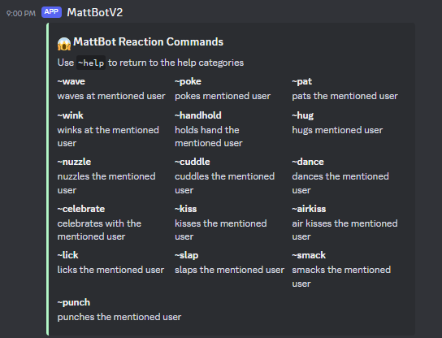
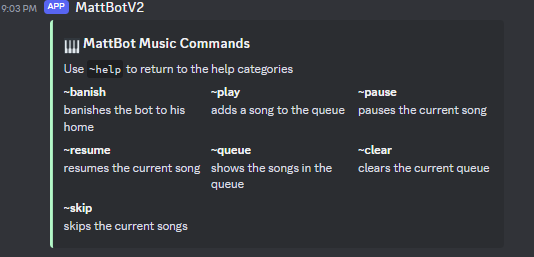

<h1>MattBot - Your Friendly Discord Companion</h1>


<h2>Description</h2>
This is a personal bot of mine that sends messages to your server's chatroom based on python. As of now, the bot is able to send a random pickup line or send a random anime GIF (based on 'reaction' command). Playing music in a voice channel is currently available; however, it is still in progress.
<br />


<h2>Languages and Utilities Used</h2>

- <b>Python</b> 
- <b>Flask</b>

<h2>Environments Used </h2>

- <b>Replit</b>

<h2>How MattBot is used:</h2>

<p align="center">
Reaction Commands: <br/>

<br />
<br />
Music Player Commands: <br/>

<br />
<br />
<!--
 ```diff
- text in red
+ text in green
! text in orange
# text in gray
@@ text in purple (and bold)@@
```
--!>
